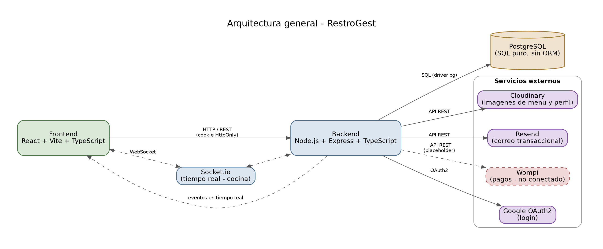

# Arquitectura general — RestroGest
 

 
## Componentes
 
- **Frontend** — React + Vite + TypeScript. Consume la API del backend vía HTTP/REST, autenticado con cookie `HttpOnly`. Se conecta además a Socket.io para recibir actualizaciones en tiempo real (pantalla de cocina).
- **Backend** — Node.js + Express + TypeScript, arquitectura en capas por módulo (ver [ADR 0005](./adr/0005-arquitectura-en-capas-backend.md)). Expone la API REST, gestiona la conexión a base de datos y orquesta las integraciones externas.
- **PostgreSQL** — persistencia relacional, sin ORM (ver [ADR 0002](./adr/0002-sql-puro-sin-orm.md)).
- **Socket.io** — canal de comunicación en tiempo real entre backend y frontend, usado para notificar nuevos pedidos y cambios de estado en la pantalla de cocina.
## Servicios externos
 
| Servicio | Uso | Estado |
|---|---|---|
| Cloudinary | Almacenamiento de imágenes (menú, avatares de perfil) | Conectado |
| Resend | Envío de correo transaccional (verificación, recuperación de contraseña, confirmaciones) | Conectado |
| Google OAuth2 | Autenticación con cuenta de Google | Conectado |
| Wompi | Pasarela de pago (tarjeta, PSE) | **No conectado** — implementado en código como placeholder. Ver [ADR 0003](./adr/0003-wompi-sin-conectar.md) y [documento de integración](./integracion-wompi.md) |
 
## Notas
 
- Todas las peticiones autenticadas del frontend usan `credentials: 'include'` para enviar/recibir la cookie de sesión — el JWT nunca se lee ni manipula desde JavaScript en el cliente.
- El backend valida en cada request (no solo al emitir el token) que el usuario siga activo y no eliminado, mediante el middleware `authenticate`.
 