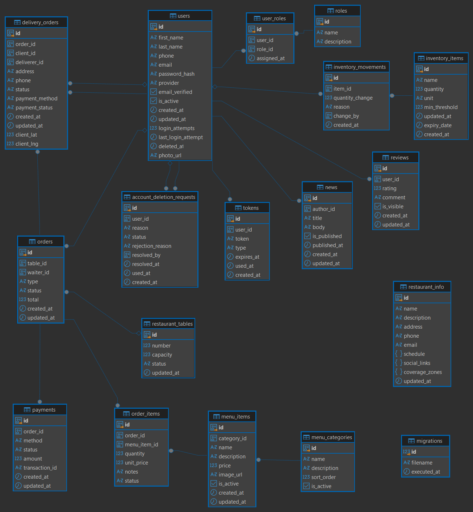

# Diagrama Entidad-Relación — Base de datos RestroGest
 
Generado con **DBeaver** (Community Edition) a partir del esquema real de PostgreSQL, tras ejecutar todas las migraciones (`npm run migrate` en `backend/`).
 

 
## Cómo se generó
 
1. Conexión a PostgreSQL en DBeaver usando las credenciales locales (`DATABASE_URL` del backend).
2. `public` schema → generador de ER Diagram integrado de DBeaver, que detecta automáticamente las relaciones a partir de las foreign keys definidas en las migraciones (`backend/src/database/migrations/`).
3. Exportado como imagen PNG.
## Cómo regenerarlo
 
Si el esquema cambia (nueva migración), el diagrama debe regenerarse repitiendo el mismo proceso — no se genera automáticamente en cada build. Ver la guía completa de instalación y uso de DBeaver más abajo si es la primera vez.
 
### Instalar DBeaver
 
1. Descargar la edición Community desde `https://dbeaver.io/download/`.
2. Instalar con el asistente por defecto.
3. Nueva conexión → PostgreSQL → completar host/puerto/base/usuario/contraseña (los mismos valores que `DATABASE_URL` en `backend/.env`).
4. Test Connection → Finish.
5. Expandir la conexión → base de datos → `Schemas` → `public` → clic derecho → **View Diagram** (o doble clic sobre `public` y abrir la pestaña de diagrama).
6. Exportar como imagen (clic derecho sobre el lienzo → *Save as image*).
## Módulos de datos representados
 
El esquema cubre las tablas de todos los módulos documentados en `API.md`: autenticación y usuarios, tokens, menú (categorías e ítems), mesas, pedidos y sus ítems, cocina, domicilios, reservas, inventario y sus movimientos, pagos, reseñas, noticias e información del restaurante.
 
## Tablas sin relaciones (no es un error)
 
Dos tablas aparecen aisladas en el diagrama, de forma intencional:
 
- **`migrations`**: tabla técnica interna usada por el script `migrate.ts` para registrar qué archivos `.sql` ya se ejecutaron. No representa una entidad del dominio del restaurante, por lo que no tiene foreign keys hacia ni desde otras tablas.
- **`restaurant_info`**: tabla de configuración tipo singleton (un único registro con los datos generales del restaurante — nombre, dirección, horario, zonas de cobertura). No existe una relación "muchos a uno" que modelar aquí, ya que es información de configuración global y no una entidad transaccional.
 