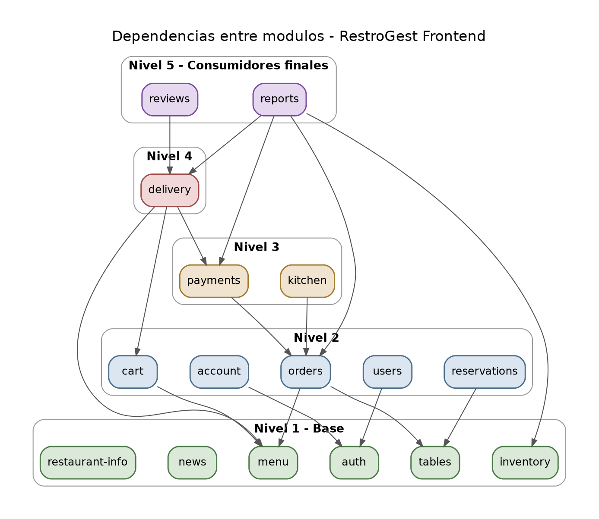

# Diagrama de dependencias entre módulos — RestroGest Frontend
 
Este diagrama refleja las dependencias de negocio reales entre módulos, derivadas de los requerimientos funcionales y las reglas de negocio documentadas (`requerimientos.md`, `reglas-negocio.md`). No es una decisión arbitraria de arquitectura: un pedido necesita el menú y las mesas, una reserva necesita las mesas, un domicilio necesita el menú y el pago, etc.
 

 
Los módulos están agrupados por nivel de dependencia (de base, abajo, a consumidor final, arriba), para que el diagrama también funcione como orden de construcción sugerido.
 
## Lectura del diagrama
 
- **Nivel 1 — Módulos base**: `menu`, `tables`, `news`, `restaurant-info`, `inventory`, `auth`. No dependen de ningún otro módulo del dominio (aunque casi todos los demás dependen de `auth` para saber quién es el usuario). Se pueden terminar en cualquier momento, no bloquean a nadie.
- **Nivel 2**: `account` y `users` dependen de `auth`; `orders` depende de `tables` + `menu`; `reservations` depende de `tables`; `cart` depende de `menu`.
- **Nivel 3**: `kitchen` depende de `orders`; `payments` depende de `orders`.
- **Nivel 4**: `delivery` depende de `menu`, `payments` y `cart` — es el módulo con más dependencias simultáneas.
- **Nivel 5 — Consumidores finales**: `reviews` depende de `delivery` (solo puede reseñar quien completó un pedido a domicilio — RF74); `reports` agrega datos de `orders`, `delivery`, `payments` e `inventory`.
## Orden de construcción sugerido
 
Dado que ya tienes `menu`, `tables` (parcial vía reservations), `auth`, `account`, `reservations`, `news`, `restaurant-info` y `cart` (parcial) avanzados, el orden que minimiza retrabajo para lo que falta es:
 
1. `tables` (backoffice) — módulo base, nada más depende de que exista su UI operativa
2. `orders` — depende de `tables` y `menu`, ambos ya listos
3. `kitchen` — depende solo de `orders`
4. `payments` — depende de `orders`, y lo necesitan tanto `delivery` como `cart`
5. `delivery` (completar checkout) y `cart` (conectar con payments) — en paralelo, ambos ya desbloqueados con `payments` listo
6. `users` — independiente, se puede hacer en paralelo con cualquiera de los anteriores
7. `reports` — al final, porque agrega datos de casi todos los módulos anteriores
 